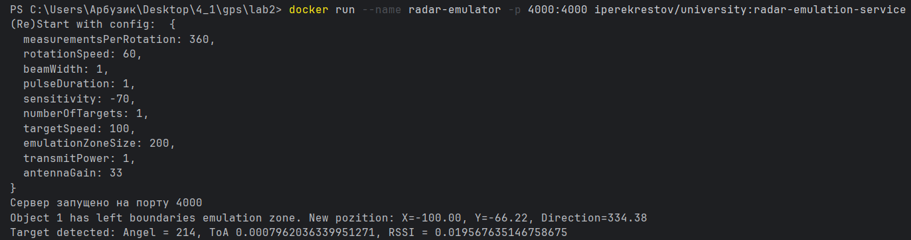
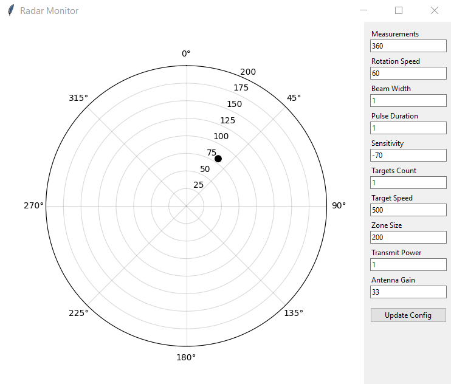
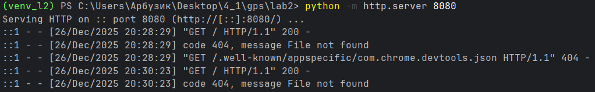
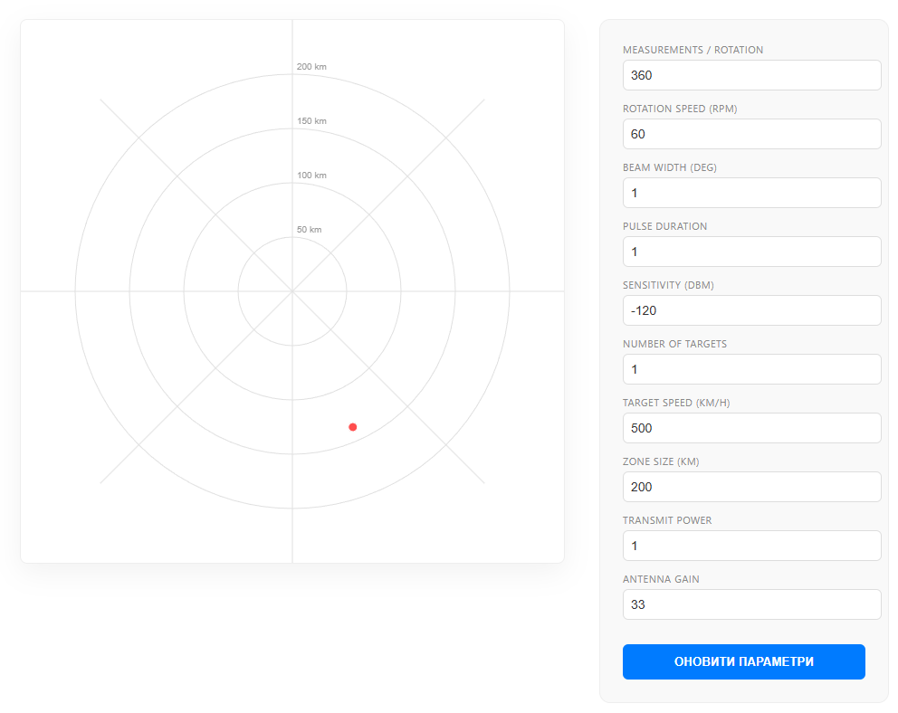

# Протокол лабораторної роботи №2

**Виконав:** Вайцеховський Олександр

**Тема:** Розробка веб-додатку для візуалізації радарних даних

---

## 1. Мета роботи

- Розробити веб-додаток для підключення до WebSocket сервера та зчитування даних про задетектовані цілі
- Реалізувати візуалізацію отриманих даних на графіку в полярних координатах
- Забезпечити обробку та відображення цілей з різними рівнями потужності сигналів
- Реалізувати можливість динамічної зміни параметрів радару через API запити

---

## 2. Теоретичні відомості

### 2.1 Принцип роботи радару

Радар (Radio Detection And Ranging) - система дистанційного виявлення об'єктів, що працює за принципом відбиття радіохвиль. Основні параметри:

- **Кут сканування (scanAngle)** - азимутальний кут напрямку променя
- **Час затримки ехо-сигналу (time)** - час від випромінювання до прийому відбитого сигналу
- **Потужність сигналу (power)** - інтенсивність відбитого сигналу

### 2.2 Розрахунок відстані до цілі

Відстань до цілі обчислюється за формулою:

```
d = (c × t) / 2
```

де:
- `d` - відстань до цілі (км)
- `c` - швидкість світла (300,000 км/с)
- `t` - час затримки ехо-сигналу (с)

Коефіцієнт 2 використовується, оскільки сигнал проходить шлях до цілі і назад.

### 2.3 Полярна система координат

У полярній системі координат кожна точка визначається парою значень (r, θ):
- `r` - радіальна відстань від початку координат
- `θ` - кут (азимут) відносно осі відліку

---

## 3. Опис реалізації

### 3.1 Архітектура додатку

Додаток складається з двох основних компонентів:

1. **Desktop версія** (Python + Matplotlib + Tkinter)
2. **Web версія** (HTML + Canvas API + PyScript)

### 3.2 Desktop версія (radar_desktop)

#### Основні компоненти:

```python
# Черги для зберігання історії координат та розмірів точок
history_r = deque(maxlen=1)
history_theta = deque(maxlen=1)
history_sizes = deque(maxlen=1)
```

#### Обробка WebSocket повідомлень:

```python
def on_message(ws, message):
    data = json.loads(message)
    angle_rad = np.deg2rad(data['scanAngle'])
    echoes = data.get('echoResponses', [])
    
    for echo in echoes:
        dist = (300000 * echo['time']) / 2  # Відстань у км
        r_list.append(dist)
        t_list.append(angle_rad)
        s_list.append(echo['power'] * 800)  # Розмір точки
```

#### Оновлення конфігурації:

```python
def update_config():
    payload = {
        "measurementsPerRotation": int(entries["measurementsPerRotation"].get()),
        "rotationSpeed": int(entries["rotationSpeed"].get()),
        # ... інші параметри
    }
    requests.put("http://localhost:4000/config", json=payload)
```

### 3.3 Web версія (radar_web.html)

#### Структура інтерфейсу:

- **Контейнер радару** (600×600 px) з двома шарами Canvas:
  - `gridCanvas` - статична сітка координат
  - `radarCanvas` - динамічне відображення цілей

#### Малювання координатної сітки:

```javascript
function drawGrid() {
    // Концентричні кола (4 рівні)
    for (let i = 1; i <= 4; i++) {
        gridCtx.arc(centerX, centerY, (i * 60), 0, Math.PI * 2);
        gridCtx.fillText(`${Math.round((zoneSize/4)*i)} km`, ...);
    }
    
    // Радіальні лінії (кожні 45°)
    for (let i = 0; i < 360; i += 45) {
        let rad = (i - 90) * Math.PI / 180;
        gridCtx.lineTo(centerX + 300 * Math.cos(rad), ...);
    }
}
```

#### Відображення цілей:

```javascript
function drawTarget(angleDeg, distance) {
    const r = (distance / zoneSize) * 300;  // Масштабування
    const theta = (angleDeg - 90) * Math.PI / 180;
    
    const x = centerX + r * Math.cos(theta);
    const y = centerY + r * Math.sin(theta);
    
    // Малюємо червону точку з білим контуром
    ctx.arc(x, y, 5, 0, Math.PI * 2);
    ctx.fillStyle = '#ff4d4d';
}
```

#### PyScript інтеграція:

```python
async def update_config(event):
    payload = {
        "measurementsPerRotation": int(document.getElementById("measurementsPerRotation").value),
        # ... інші параметри
    }
    await pyfetch(url, method="PUT", body=json.dumps(payload))

def on_message(event):
    data = json.loads(event.data)
    for echo in data.get('echoResponses', []):
        dist = (300000 * float(echo['time'])) / 2
        drawTarget(float(data['scanAngle']), dist)

ws = WebSocket.new("ws://localhost:4000")
ws.onmessage = on_message
```

---

## 4. Параметри конфігурації радару

| Параметр | Опис | Значення за замовчуванням |
|----------|------|---------------------------|
| measurementsPerRotation | Кількість вимірювань на оберт | 360 |
| rotationSpeed | Швидкість обертання (RPM) | 60 |
| beamWidth | Ширина променя (градуси) | 1 |
| pulseDuration | Тривалість імпульсу | 1 |
| sensitivity | Чутливість приймача (dBm) | -120 |
| numberOfTargets | Кількість цілей | 1 |
| targetSpeed | Швидкість цілі (км/год) | 500 |
| emulationZoneSize | Розмір зони емуляції (км) | 200 |
| transmitPower | Потужність передавача | 1 |
| antennaGain | Коефіцієнт посилення антени | 33 |

---

## 5. Результати тестування

### 5.1 Desktop версія

**Особливості:**
- Використання полярного графіка Matplotlib
- Розмір точок залежить від потужності сигналу (power × 800)
- Панель керування з можливістю зміни всіх параметрів
- Реал-тайм оновлення через WebSocket

### 5.2 Web версія

**Особливості:**
- Двошаровий Canvas для оптимізації перемалювання
- Адаптивна координатна сітка
- Відображення відстані у кілометрах на кільцях
- PyScript для обробки даних безпосередньо в браузері

## 6. Порівняльний аналіз реалізацій

| Критерій | Desktop (Python) | Web (HTML+PyScript) |
|----------|------------------|---------------------|
| **Продуктивність** | Висока (нативний Python) | Середня (інтерпретація в браузері) |
| **Портативність** | Потребує Python | Працює в будь-якому браузері |
| **Складність розгортання** | Встановлення залежностей | Відкриття HTML файлу |
| **Графічні можливості** | Matplotlib (професійні графіки) | Canvas API (кастомна графіка) |
| **Інтерактивність** | Tkinter widgets | HTML forms |
| **Розмір пакету** | ~50 MB (з залежностями) | ~5 MB (PyScript CDN) |

---

## 7. Висновки

1. **Реалізовано два функціональних додатки** для візуалізації радарних даних з підтримкою:
   - WebSocket підключення для реал-тайм даних
   - REST API для зміни конфігурації
   - Відображення цілей у полярних координатах

2. **Desktop версія** краще підходить для:
   - Професійного аналізу даних
   - Роботи з великими обсягами історії
   - Складних обчислень

3. **Web версія** краще підходить для:
   - Швидкого розгортання
   - Демонстрацій та презентацій
   - Доступу з різних пристроїв

4. **Точність обчислень** підтверджена формулою `d = c×t/2`

5. **Масштабованість** забезпечена через параметр emulationZoneSize

---

## 8. Інструкції для запуску

### Desktop версія:
1. Скачати контейнер

2. Запустити контейнер

3. Встановлення залежностей та запуск сервера
```bash
pip install -r requirements.txt
python radar_desktop.py
```

4. Вид десктоп радару:


### Web версія:
1. Скачати контейнер

2. Запустити контейнер

3. Запустити сервера

4. Вид веб радару:


---

## 9. Використані технології

- **Python 3.12+** - основна мова програмування
- **Matplotlib** - візуалізація графіків
- **Tkinter** - GUI для desktop версії
- **PyScript** - виконання Python в браузері
- **Canvas API** - відмалювання графіки в веб
- **WebSocket** - двостороння комунікація
- **REST API** - оновлення конфігурації